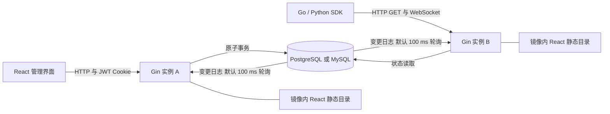

# ConfHub 关键架构

需求边界见 [requirements.md](requirements.md)。本文汇总已经逐项明确的关键架构，具体方法签名、DDL 和依赖版本在实现阶段确定。本阶段只完成设计，不编写或运行压测流程。

## 部署与认证

| 决策 | 方案 | 状态 |
| --- | --- | --- |
| 部署形态 | React 构建产物作为独立目录复制到镜像，由 Go HTTP 服务承载，不嵌入可执行文件；任意实例提供管理界面与客户端入口 | 已确认 |
| HTTP 框架 | 使用 Gin | 已确认 |
| 客户端协议 | HTTP GET 即时读取；WebSocket 单连接承载多个订阅并推送完整有效配置及版本、删除状态 | 已确认 |
| 数据库写入 | 单次事务提交内容快照、发布目标、乐观锁修订和持久变更日志；用事务计数行保证变更日志提交顺序 | 已确认 |
| 读取一致性 | 管理端读取共享数据库；客户端读取和推送使用有界缓存，正常运行允许传播期间短暂读到旧值 | 已确认 |
| 管理认证 | 使用简单的纯 JWT，不存储管理会话，不采用数据库会话表 | 已确认 |

前端由 Go/Gin 直接提供构建目录的静态文件，不引入第二个前端 HTTP 服务。SPA 页面回退与管理、客户端接口及 WebSocket 路由分开，不能把未知接口或缺失静态资源回退为 index.html。

管理认证采用默认有效 2 小时的纯 JWT，不提供刷新令牌，由浏览器 HttpOnly Cookie 携带。所有实例通过 flag 或环境变量使用相同签名密钥。仅验签及过期时间的 JWT，退出登录或修改密码不会自动撤销已经签发的令牌；它们在到期或签名密钥改变前仍可能有效。之前提出的数据库会话即时失效方案不再采用。浏览器管理请求采用同源策略，并校验状态变更请求来源，以配合 Cookie 认证。

## 数据模型

- `namespace`、`group`：配置组织结构。
- `config`：配置实例身份、业务名称、全量目标、版本计数及编辑修订。
- `config_version`：不可修改的内容快照、格式、内容摘要、描述、操作类型、时间及来源版本。
- `gray_rule`：所属配置、启用状态、顺序、AND 条件、目标版本。
- `change_stream`、`change_event`：事务内递增的流序号与持久变更日志。与配置历史版本保留策略分别处理。
- `admin`：共享管理身份与密码状态；不设置 admin_session 表。

配置版本号与编辑修订、变更日志序号是不同概念。规则排序可能不创建内容版本，但必须更新编辑修订并产生变更通知。灰度指定已有版本可能让客户端有效版本号下降，不能用内容版本号作为状态新旧的唯一依据。

删除后同名重建必须有新的配置实例身份。删除事件必须携带原配置实例身份与业务键；SDK 和缓存必须能区分旧配置删除与新配置创建，不能仅比较重置后的版本号。

## 已确认的数据库事务模型

针对每秒 10 次发布的第一版负载，所有有效配置变更事务先锁定共享的 `change_stream` 计数行，然后校验编辑修订、写入版本和目标、递增流序号、写入事件，并共同提交。事务持锁到提交，失败整体回滚；正文校验与 diff 在事务外完成，以缩短持锁时间。

这会串行化配置变更写事务，是为了简化跨数据库的可靠游标模型。它不串行化客户端读取、连接或回调。吞吐、锁等待与 P99 必须实测；后续若写入规模明显增长，需重新评估该取舍。

不能使用 PostgreSQL sequence 或 MySQL AUTO_INCREMENT 直接作为可靠提交水位。例如事务 A 先取得 101 尚未提交，事务 B 取得 102 并提交；消费者读到 102 后推进游标，A 再提交 101，就会遗漏 A。普通事务字段与同一计数行的提交前排他锁用于避免这种提交乱序。

## 同步与恢复

第一版 PostgreSQL 和 MySQL 均采用每实例独立的变更日志轮询，间隔通过 flag 或环境变量配置，默认 100 ms；暂不分别引入 LISTEN/NOTIFY、binlog CDC 或节点间通知。3 实例约产生每秒 30 次周期轮询查询，本地提交唤醒和批次续读可能增加查询，数据库成本需实测。数据库日志消费者必须是广播语义，每实例都处理变化，不能竞争领取一条共享队列。

本实例提交后可唤醒本地消费循环，但不能直接把消费游标跳到刚提交的序号，否则可能跳过其他配置尚未处理的变更。完整处理日志批次后才推进游标；同一配置的一批事件可合并为最新状态读取。

以下参数和策略已经确认：

- 日志默认保留 24 小时，清理时维护已清理水位；节点游标早于保留范围时，执行快照补偿而非静默跳过。
- 缓存默认以 64 MiB 字节预算限制，计入正文与共享编码结果，不预载所有历史版本；并发读取相同版本时合并加载。缓存预算不是总 RSS 上限。
- 每条连接按配置键保留最新待发送状态，正文共享；写入超时 5 秒时关闭连接，由 SDK 重连同步最终状态，避免无限积压。
- WebSocket 心跳间隔 10 秒、无响应超时 30 秒；存在健康实例且已检测断线时，恢复目标为 P99 不超过 5 秒。全部地址不可用时从约 500 ms 开始指数退避，最大 30 秒，并增加随机抖动。
- 节点连续 2 秒无法同步数据库时退出就绪状态，并关闭客户端连接；完成状态补偿后重新就绪。
- JWT 默认有效 2 小时、不提供刷新令牌；所有实例通过 flag 或环境变量共享签名密钥。退出只清除浏览器令牌，修改密码影响后续登录，不自动撤销旧令牌。

任何方案都必须处理：

- 先建立订阅再取得一致的初始状态，或使用等价的修订校验，避免初始读取与订阅之间漏变更。
- 节点重启、数据库连接恢复及日志过期后的快照补偿。
- 配置删除后的缓存清理，以及同名重建的身份隔离。
- 每条连接的有界待发送状态与慢客户端处理，避免按客户端复制无限正文队列。
- SDK 回调阻塞、重复传输、旧响应晚到与重连后的最新状态同步。
- 只在数据库事务提交后发布变化，客户端收到的内容与目标状态保持一致。

## 已确认链路

图示两个实例用于说明链路，验收部署为三个实例；任意实例均提供图中完整入口。数据库保存持久状态，实例内只有可重建缓存、消费游标和连接状态。

## SDK

SDK 以原文快照和版本元数据为基础，提供获取、订阅、取消订阅及关闭，返回原文、版本、格式及在线或离线缓存来源。Go 使用 context；Python 同时提供同步接口与原生 asyncio 接口，允许异步回调，不提供框架自动注入或配置合并。

异步接口在应用 event loop 上执行异步 I/O，不能把阻塞请求直接放进协程。同步入口通过受控后台运行方式访问协议能力，跨线程调度使用 asyncio 的线程安全机制；不能在已经运行的 event loop 中调用 asyncio.run。回调调度与网络接收分开，取消订阅和关闭必须回收相关任务与连接。

内存与磁盘缓存按配置业务键、服务集群及标签上下文区分。重连和订阅重建后以当前权威快照补偿；旧连接、旧查询或旧标签上下文的晚到响应不能覆盖新状态。明确删除后移除缓存，同名重建使用新配置实例身份。

## 前端

使用 React、TypeScript、Vite 与 CodeMirror 6。语言扩展按需加载，保存确认和版本列表使用 merge/diff 扩展，明确配置只读对比视图。JSON、YAML 格式化接入专门 formatter，不把语法高亮或缩进误当作校验与格式化。

普通编辑、灰度编辑与回退使用同一确认逻辑：展示正文 diff、当前发布目标和影响范围，允许选择历史对比版本，确认后提交原始编辑基准。切换对比对象不改变发布目标或乐观锁条件；冲突后保留输入，要求重新对比和确认。

## 数据库访问与迁移

应用事务读写通过数据库驱动与 SQL Adapter 封装两种后端差异。迁移使用 `github.com/golang-migrate/migrate/v4`，分别维护 PostgreSQL 和 MySQL 的版本化 SQL 来源；不用 ORM 自动改表，也不自行实现替代迁移框架。

首次初始化可以在已经存在、可连接的空数据库上通过 migrate 创建表，然后初始化 admin 与默认组织数据；不会自动创建数据库、账号或权限。已有库升级使用同一程序的 migrate 子命令。所有执行者连接同一实际写库，保持相同迁移表及锁配置，使用官方驱动的 session 锁；不能把多个独立可写 MySQL 节点视为一把共享锁。

使用独立迁移连接或连接池，避免 migrate.Close 关闭仍供业务使用的共享池。锁等待失败或迁移失败时不给出就绪状态；官方默认 schema_migrations 保存 version 和 dirty，不提供逐文件 checksum。dirty 表示未完成迁移，不能自动 Force 清除；先确认实际数据库状态并修复。MySQL 多条 DDL 可能部分完成，migrate 不会令其变为可整体事务回滚。

迁移 SQL 可以通过 iofs 接入 fs.FS；若选择嵌入，仅嵌入迁移 SQL，与 React 不嵌入二进制的要求分别处理。具体迁移来源及依赖版本在实现时固定。

## 后台维护

日志和历史清理由各实例尝试取得数据库短期租约后分批执行，不固定维护主实例。任务可重试，使用短事务，清理前重新检查引用；需要与版本绑定操作协调，避免删除并发绑定的版本。历史数量允许短暂多出待清理版本，任务完成后满足保留策略。

## Docker Compose 与后续验证

提供同一应用镜像的单实例及多实例 Compose 部署方式，并分别支持 PostgreSQL、MySQL 后端。多实例共享数据库和 JWT 签名密钥；只为数据库配置持久卷，实例缓存和消费游标可重建。客户端可配置多个服务地址，不强制部署额外负载均衡组件；数据库自身高可用仍由部署环境提供，单个 Compose 数据库容器不代表数据库高可用。

后续验证环境也使用 Docker Compose。保留基线为每个服务节点 4 vCPU、1 GiB 可用内存，数据库 4 vCPU、8 GiB、SSD，节点间 1 Gbps、RTT 不超过 1 ms；数据库与负载生成器独立部署。Compose 本身不能保证跨主机网络规格。进程 RSS 和 P99 指标仍是未验证目标，当前不制作压测脚本、步骤或负载容器。

## Module 与 Interface

遵循 codebase-design 的小 Interface 原则；以下是行为分工，包名和方法签名在实现时确定。

- **配置管理 Module**：通过小 Interface 提供变更、历史查询与有效配置解析，内部集中处理语法校验、无变化判断、乐观锁、回退、版本引用和事务提交。
- **存储 Adapter**：在真实需要变化的数据库 Seam 上提供 PostgreSQL、MySQL 两个 Adapter，封装事务及方言差异。避免为每张表建立仅转发 CRUD 的浅 Module。
- **灰度解析 Module**：以配置状态和标签为输入，返回命中规则与有效版本；同一份规则计算用于管理端试算和客户端读取。
- **订阅同步 Module**：Interface 暴露订阅、退订和状态同步，内部集中处理缓存更新、配置身份、修订排序、连接背压与恢复。
- **SDK Module**：通过获取、订阅与关闭等小 Interface，封装地址切换、重连、缓存、删除与回调调度。

前端只完成编辑与确认交互，服务端必须重新校验格式、目标身份和乐观锁条件。切换 diff 对比对象不能替换编辑基准或绕过服务端并发校验。

## 已核实的事实与来源

- [PostgreSQL NOTIFY](https://www.postgresql.org/docs/current/sql-notify.html)：提交后交付；默认载荷小于 8000 字节；不能替代持久变更日志。
- [PostgreSQL LISTEN](https://www.postgresql.org/docs/current/sql-listen.html)：监听属于数据库 session；先完成 LISTEN，再查询当前状态以避免建立监听竞态。
- [PostgreSQL sequence](https://www.postgresql.org/docs/current/functions-sequence.html) 与 [MySQL AUTO_INCREMENT](https://dev.mysql.com/doc/refman/8.4/en/innodb-auto-increment-handling.html)：分配不等同于事务提交顺序，回滚会造成空洞。
- [PostgreSQL 锁](https://www.postgresql.org/docs/current/explicit-locking.html) 与 [MySQL 锁定读](https://dev.mysql.com/doc/refman/8.4/en/innodb-locking-reads.html)：事务锁可保护计数行；SKIP LOCKED 队列竞争不等同于每实例广播。
- [MySQL 复制实现](https://dev.mysql.com/doc/refman/8.4/en/replication-implementation.html)：binlog CDC 属于复制协议方案，涉及日志、权限和位点管理，不是普通 SQL 通知接口。
- [SSE 标准](https://html.spec.whatwg.org/multipage/server-sent-events.html) 与 [WebSocket RFC 6455](https://www.rfc-editor.org/rfc/rfc6455)：两者都可携带多个配置的事件；SSE 单向，WebSocket 提供同连接双向消息。两者本身都不保证断线期间的配置历史重放。
- [JWT RFC 7519](https://www.rfc-editor.org/rfc/rfc7519#section-4.1.4)：包含 exp 的令牌在到期后不得接受；本应用应要求过期声明。纯 JWT 不提供自动撤销语义。
- [OAuth Token Revocation RFC 7009](https://www.rfc-editor.org/rfc/rfc7009#section-3)：说明自包含令牌的即时撤销需要额外状态或后端交互，作为纯 JWT 的限制参考。
- [Gin 静态文件](https://gin-gonic.com/en/docs/rendering/serving-static-files/) 与 [Static 方法](https://pkg.go.dev/github.com/gin-gonic/gin#RouterGroup.Static)：可直接服务镜像内构建目录，无需另一个前端服务器；文件服务的 404 与 SPA 页面回退需要区分。
- [CodeMirror EditorView](https://codemirror.net/docs/ref/#view.EditorView)、[merge 扩展](https://codemirror.net/docs/ref/#merge)、[语言映射](https://github.com/codemirror/language-data/blob/main/src/language-data.ts)：有 DOM 编辑器、diff 及所需语言高亮机制；React 生命周期集成和完整格式化需另行实现。
- [MySQL Atomic DDL](https://dev.mysql.com/doc/refman/8.4/en/atomic-ddl.html) 与 [隐式提交](https://dev.mysql.com/doc/refman/8.4/en/implicit-commit.html)：单条原子 DDL 不等于多条迁移语句可共同事务回滚。
- [PostgreSQL Advisory Lock](https://www.postgresql.org/docs/current/functions-admin.html#FUNCTIONS-ADVISORY-LOCKS) 与 [MySQL GET_LOCK](https://docs.oracle.com/cd/E17952_01/mysql-8.0-en/locking-functions.html)：session 锁必须使用固定连接；MySQL 命名锁只作用于同一 mysqld，迁移者须连接同一实际写节点。
- [golang-migrate](https://github.com/golang-migrate/migrate)、[执行与 Force 源码](https://github.com/golang-migrate/migrate/blob/master/migrate.go)、[PostgreSQL 驱动](https://github.com/golang-migrate/migrate/blob/master/database/postgres/postgres.go)、[MySQL 驱动](https://github.com/golang-migrate/migrate/blob/master/database/mysql/mysql.go)：提供迁移锁及 version/dirty 管理，Force 不修复 schema，驱动关闭可能关闭其连接池。
- [iofs 示例](https://github.com/golang-migrate/migrate/blob/master/source/iofs/example_test.go)：接收 fs.FS，可用于 SQL 来源；不能把 iofs URL 直接当作受支持的来源 URL。
- [asyncio 多线程](https://docs.python.org/3/library/asyncio-dev.html#concurrency-and-multithreading)、[task 调度](https://docs.python.org/3/library/asyncio-task.html)、[Runner](https://docs.python.org/3/library/asyncio-runner.html)：跨线程提交需线程安全调度，已有 event loop 内不能调用 asyncio.run。

P99 不超过 300 ms 的目标范围是数据库事务提交到目标 SDK 获得新内容，包含跨实例传播和 SDK 调度，而不是仅测通知到达。当前尚未压测。
